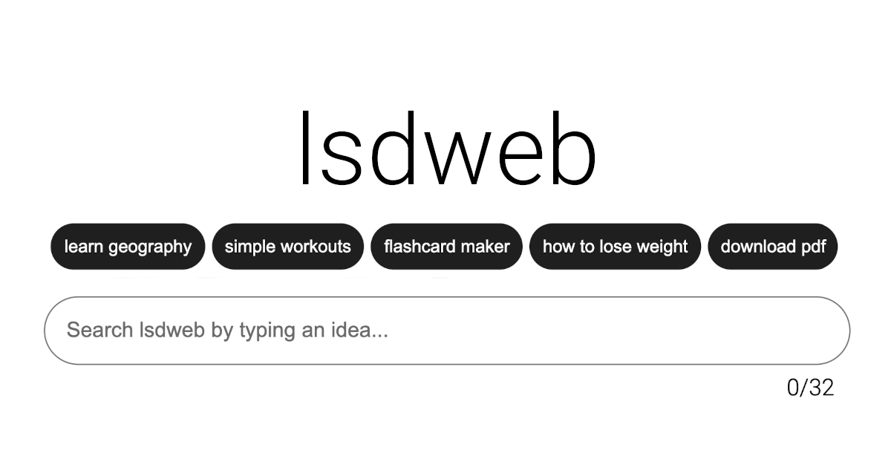

Hi I'm Sevora
=================

Technologies I'm Great At
----------------------------

Projects I Made
------------------
### [Portfolio](https://sevora.github.io/portfolio/)

Check out my portfolio [live here](https://sevora.github.io/portfolio/). A compilation of my works in a single-page application without using any additional frameworks. Developed with TypeScript and Vite.

### [lsdweb.net](https://lsdweb.net)

A single-page application generator powered by OpenAI. Check it out [live here](https://lsdweb.net). The frontend was developed without using any frameworks and only native web technologies. The backend is written in TypeScript with Express. 

### [bl0g.pro](https://bl0g.pro)

A site with interesting special effects. Check it out [live here](https://bl0g.pro). It is also a single-page application without using any frameworks. Originally done as a project for one of my classes. Developed with TypeScript and Vite.

### [stmviz](https://sevora.github.io/stmviz/)

Stable-Marriage Algorithm Visualizer developed for AlgoExpert SWE Project Contest of Summer-Fall 2020. Try it out [here](https://sevora.github.io/stmviz/). You can also watch the 1-minute trailer on [YouTube](https://youtu.be/yxNn02h3MzI). Developed with vanilla JavaScript and no frameworks.

### [Simple Calculator](https://github.com/sevora/simple-calculator)

Knowing how to code is one thing, structuring a project is another. I made this desktop application with Java as a way to test out my skills and learn more about organizing code and making something that's easy to modify and maintain. Download it [here](https://github.com/sevora/simple-calculator/releases/tag/v2.0.0). This was developed with Java 11 + Maven and JavaFX.

Need a Collaborator
----------------------
I'm open to requests for collaboration and we can discuss the project you're working on. You could reach out to me via [email](mailto:ralph.louis.g@gmail.com).

Awesome Art by TenaceTracks
---------------------------
[@TenaceTracks](https://twitter.com/TenaceTracks) is a friend of mine and he makes pretty amazing digital art.

