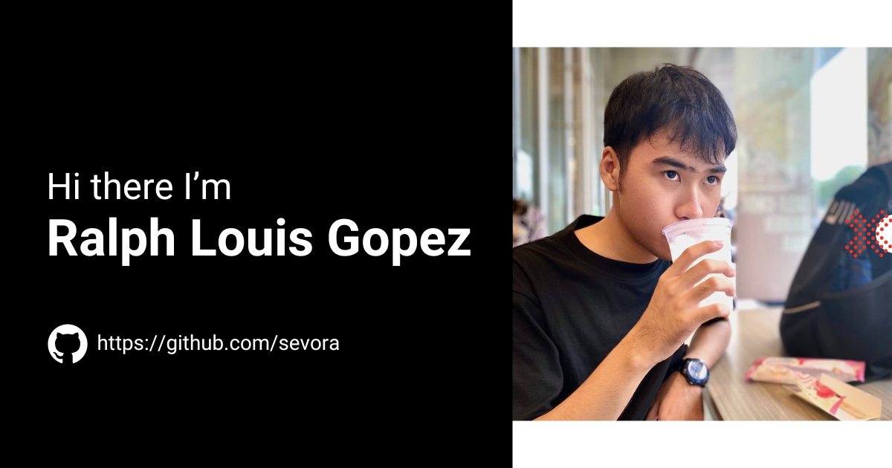
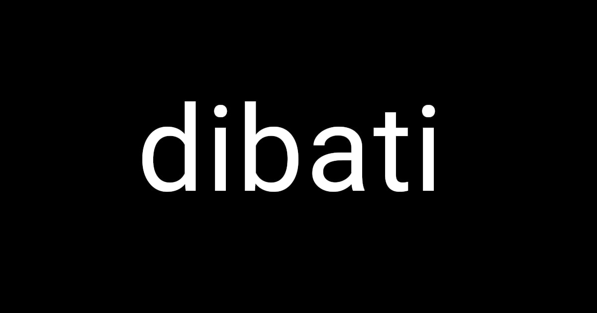
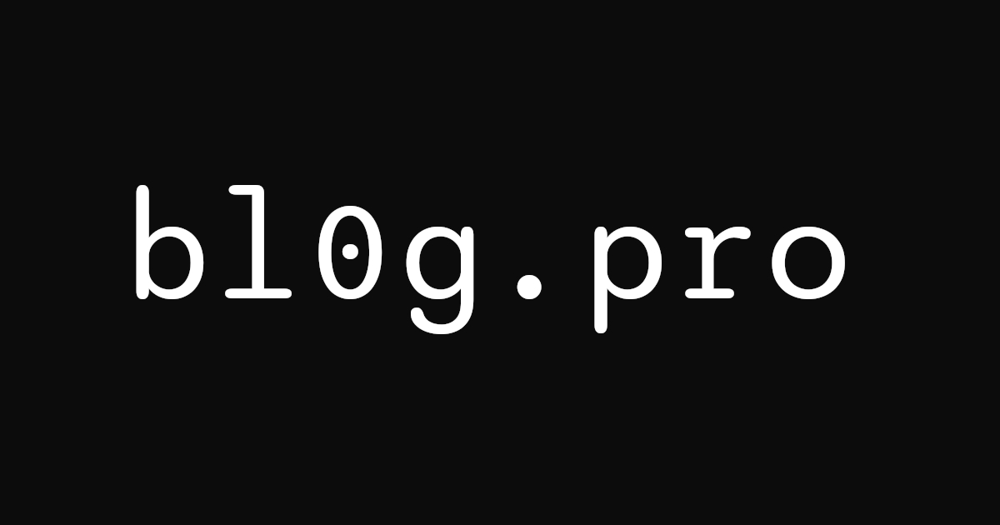
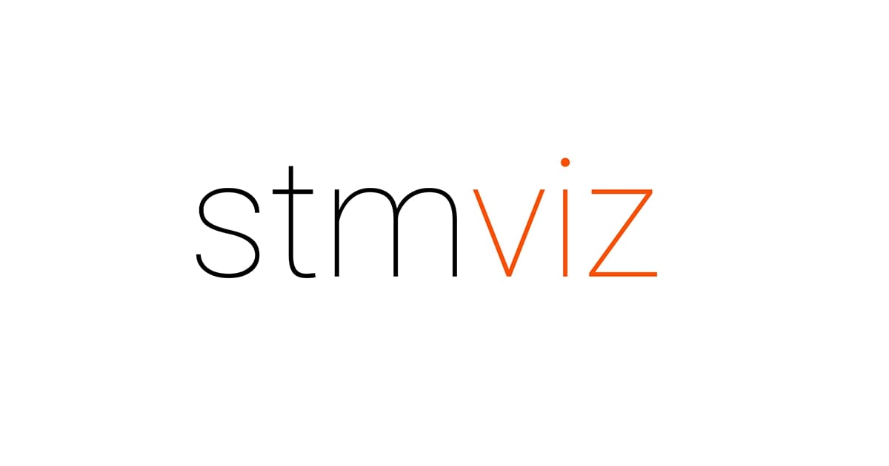
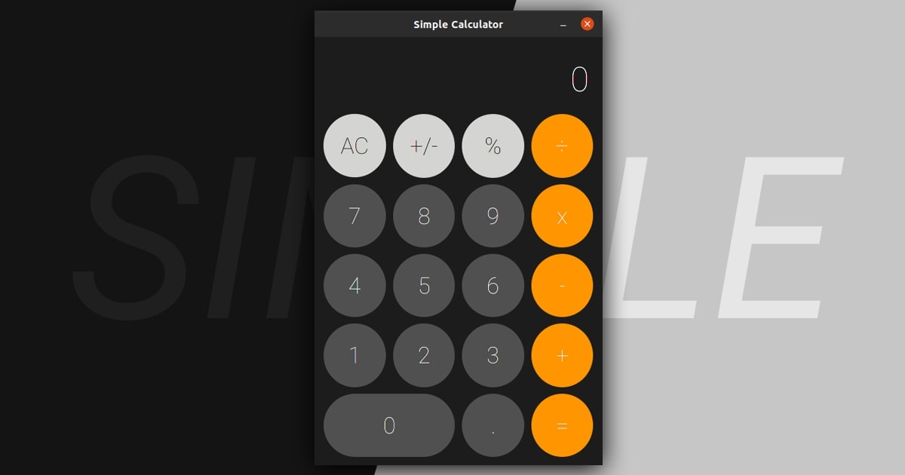

# Hi I'm Sevora

## Technologies I'm Great At
  
  
  

## Projects I Made
### [Portfolio](https://sevora.github.io/portfolio/)

Check out my portfolio [live here](https://sevora.github.io/portfolio/). A compilation of my works in a single-page application without using any additional frameworks. Developed with TypeScript and Vite.

### [Cinelaya](https://cinelaya.com)

A suite of tools to aid filmmakers bring their imagination into reality. This project, also a company, was founded by Gil Ponce. Take a look [here](https://cinelaya.com). I am the fullstack developer of the web application, and desktop software, continuously adding features and optimizations.

### [dibati.com](https://dibati.com)

An anonymous debate chat application. Check it out [live here](https://dibati.com). The idea is that users with opposing ideas get matched. This site was designed to be scalable and performant loading almost instantaneously and working seamlessly even for hundreds of thousands of users. 

### [Turn the Dial](https://story.ralphlouisgopez.com)

A fun website that shows my personal story. It won't give off a professional vibe but rather something more homey. I used the theme of a watch as I like the concept of being able to show the past and the present. Check it out [here](https://story.ralphlouisgopez.com)

### [bl0g.pro](https://github.com/sevora/bl0g)

A site with interesting special effects. Not currently hosted but source code is in [a repository](https://github.com/sevora/bl0g). It is also a single-page application without using any frameworks. Originally done as a project for one of my classes. Developed with TypeScript and Vite.

### [stmviz](https://sevora.github.io/stmviz/)

Stable-Marriage Algorithm Visualizer developed for AlgoExpert SWE Project Contest of Summer-Fall 2020. Try it out [here](https://sevora.github.io/stmviz/). You can also watch the 1-minute trailer on [YouTube](https://youtu.be/yxNn02h3MzI). Developed with vanilla JavaScript and no frameworks.

### [Simple Calculator](https://github.com/sevora/simple-calculator)

Knowing how to code is one thing, structuring a project is another. I made this desktop application with Java as a way to test out my skills and learn more about organizing code and making something that's easy to modify and maintain. Download it [here](https://github.com/sevora/simple-calculator/releases/tag/v2.0.0). This was developed with Java 11 + Maven and JavaFX.

### [Code Journal](https://blog.ralphlouisgopez.com/)

My actual blog site made via Jekyll. I post my experiences, thoughts, and stories here. If you're interested you could take a look at it [here](https://blog.ralphlouisgopez.com/).

## Need a Collaborator
I'm open to requests for collaboration and we can discuss the project you're working on. You could reach out to me via [email](mailto:ralph.louis.g@gmail.com).

## Awesome Art by TenaceTracks
[@TenaceTracks](https://twitter.com/TenaceTracks) is a friend of mine and he makes pretty amazing digital art.

